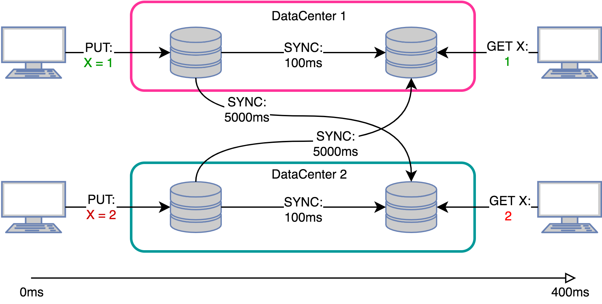

> Artigo original [aqui](https://medium.com/@amberovsky/crdt-conflict-free-replicated-data-types-b4bfc8459d26).

# CRDT: Cross-free Replicated Data Type

Como contar os acessos do google.com? E sobre como armazenar “curtidas” de usuários populares? Neste artigo, vamos considerar soluções para essas tarefas usando CRDT (tipos de dados replicados sem conflito) e também um caso mais geral - como sincronizar réplicas em um sistema distribuído com vários líderes.

