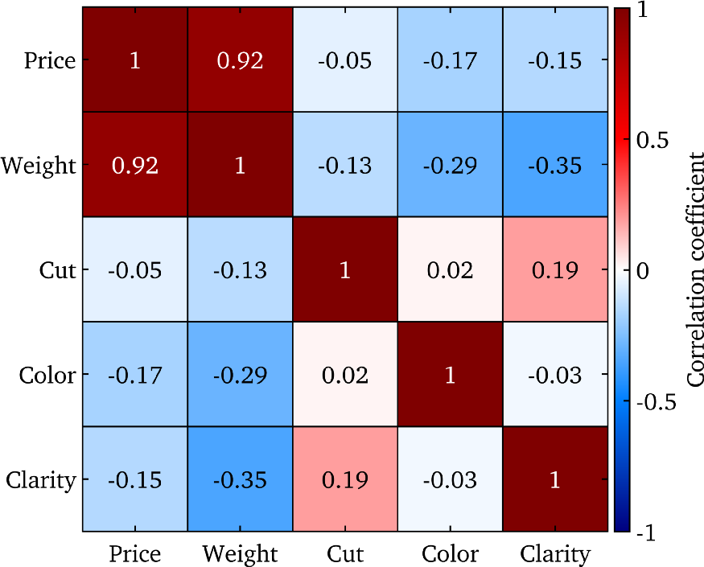
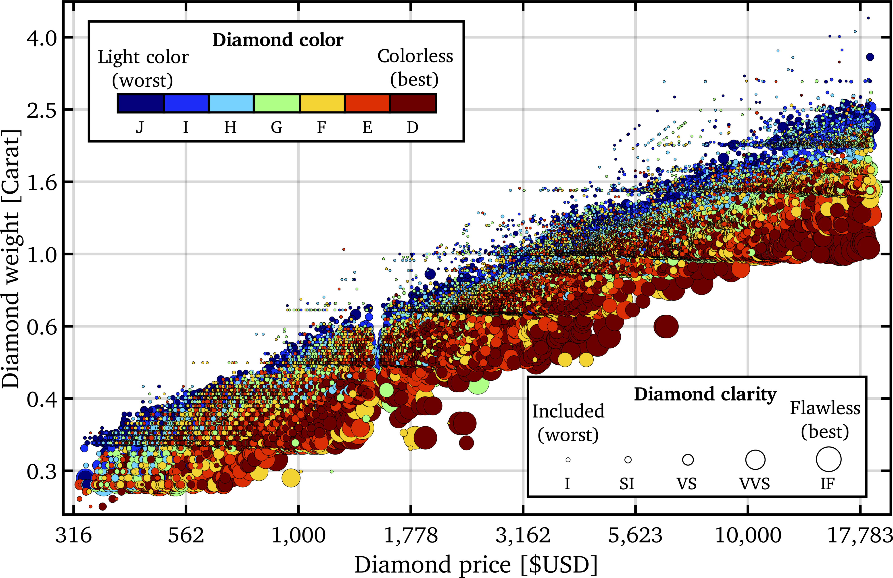
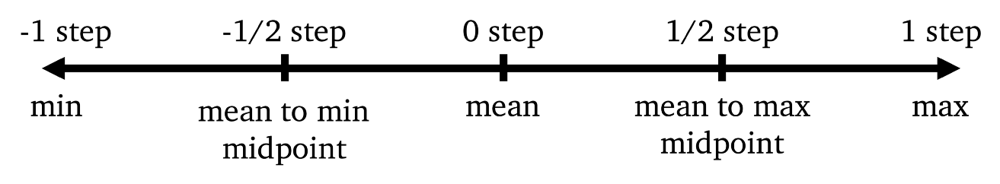
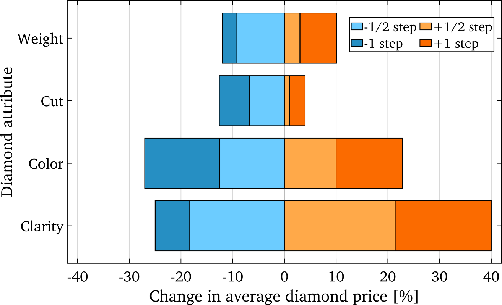
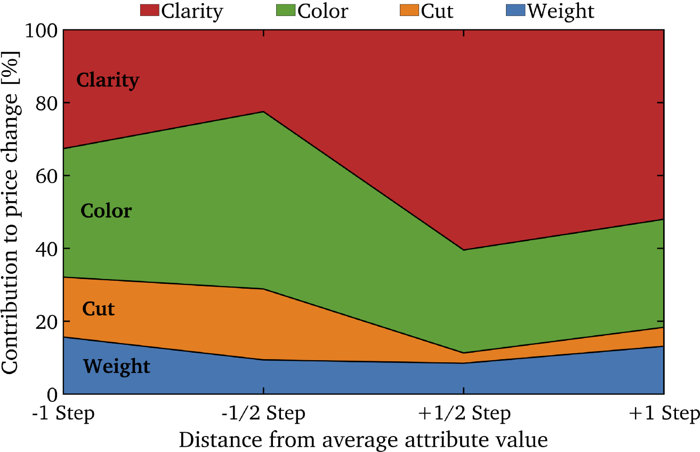
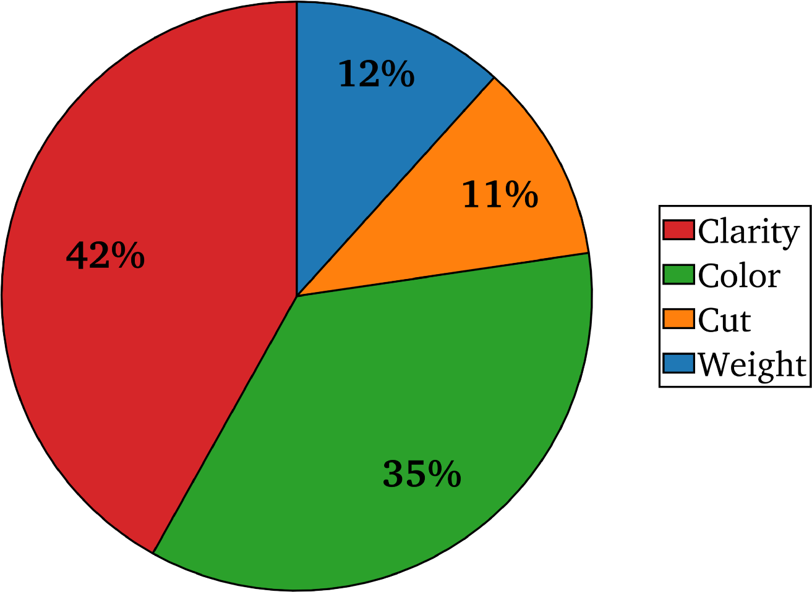
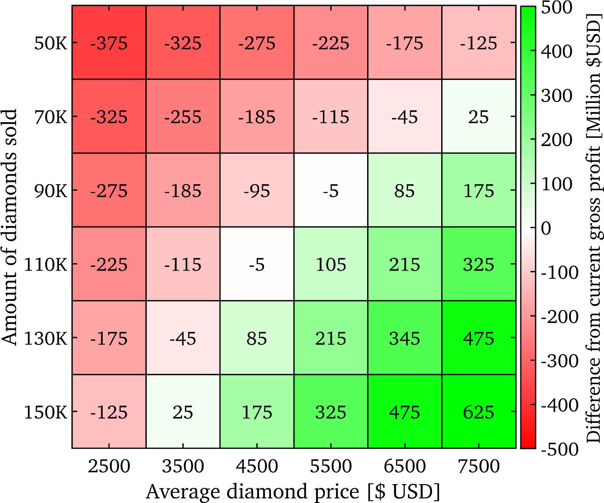

> [Original here](https://towardsdatascience.com/the-sensitivity-analysis-a-powerful-yet-underused-tool-for-data-scientists-e553fa695976)

# Sensitive Analysis: uma ferramenta poderosa, porém subutilizada para cientistas de dados

Quantificar os efeitos de várias entradas diferentes, aplicadas em um conjunto de dados de gemas com mais de 50 mil diamantes de lapidação redonda

As análises de sensibilidade envolvem a variação das entradas de um sistema para avaliar os impactos individuais de cada variável na saída e, em última análise, fornecer informações sobre os diferentes efeitos de cada variável testada. As análises de sensibilidade são normalmente usadas em uma variedade de disciplinas, como em negócios para modelagem financeira ou em engenharia para otimizar a eficiência em um determinado sistema. Se usada corretamente, a análise de sensibilidade pode ser uma ferramenta poderosa para revelar percepções adicionais que, de outra forma, seriam perdidas.

Embora os cientistas de dados sejam ótimos na modelagem e na criação de informações acionáveis com base na compreensão e interpretação de conjuntos de dados ou fluxos de trabalho, as sensibilidades das entradas básicas são frequentemente ignoradas. A realização de uma análise de sensibilidade simples pode agregar valor a um projeto de ciência de dados, fornecendo informações adicionais às partes interessadas para a tomada de decisões mais informadas. Embora a implementação de análises de sensibilidade não seja viável ou desejável para certas tarefas, elas podem servir como uma ferramenta exploratória adicional para cientistas de dados obterem percepções adicionais de conjuntos de dados multivariados.

Neste tutorial, examinaremos uma análise de sensibilidade simples usando alguns dados de gemas reais. Primeiro, vamos realizar uma análise exploratória de dados no conjunto de dados de diamantes para que possamos entender melhor os resultados da análise de sensibilidade que será discutida na seção seguinte.

## Explorando o conjunto de dados de diamantes

Estaremos usando um conjunto de dados de gemas bem conhecido que está disponível no R ou também pode ser encontrado no Kaggle.

- O conjunto de dados contém 53.940 diamantes de corte redondo e mede vários atributos para cada diamante. Estaremos nos concentrando nos cinco seguintes:
- O preço é o valor em dólares do diamante medido em $ USD e varia de $ 326 a $ 18.823
- O peso é a massa do diamante, medida em quilates (um quilate é igual a 0,2 gramas) e varia de 0,2 a 5,01 quilates
- A clareza quantifica a transparência de um diamante com base na quantidade, localização e tipo de inclusões que ele contém
- A cor mede o grau em que o diamante tem uma leve mancha ou é incolor
- Corte refere-se à qualidade do corte do diamante, pois tem um impacto significativo nas propriedades ópticas do diamante
  Para obter mais informações sobre os atributos do diamante ou se você estiver curioso para saber como eles são quantificados, consulte este link.

## Correlações de atributos e relações aparentes

As matrizes de coeficientes de correlação costumam ser a primeira ferramenta usada para determinar relacionamentos entre variáveis. Abaixo está a matriz do coeficiente de correlação para os cinco atributos de diamante que estamos considerando.

> Matriz de correlação para os cinco atributos de interesse no conjunto de dados de diamantes. Imagem do autor

Obtemos algumas correlações que esperamos, como o coeficiente de correlação de 0,92 entre o preço e o peso do diamante, deixando claro que o peso do diamante tem o maior impacto em seu preço. No entanto, também obtemos algumas tendências incomuns, como as pequenas correlações negativas entre o corte do diamante, a cor e a clareza com o preço. Essa correlação negativa se deve aos diamantes mais leves com melhores cortes, cor e clareza quando comparados aos diamantes mais pesados, resultando em correlações enganosas de como melhorar esses atributos individuais resulta em um preço menor.

## Uma análise mais detalhada dos dados para revelar informações adicionais

Podemos usar um gráfico de dispersão e implementar algumas técnicas de visualização multidimensional para entender melhor como os atributos do diamante estão relacionados. Abaixo está um gráfico de dispersão log-log mostrando a relação entre o peso, cor e clareza do diamante com o preço.

> Gráfico de dispersão de vários atributos do diamante, mostrando o preço crescente ao aumentar o peso, a cor ou a clareza do diamante. Embora o atributo de corte de diamante não seja mostrado aqui, o efeito é semelhante à cor e clareza do diamante. Imagem do autor

Na figura acima, agora percebemos que, enquanto mantemos outros atributos constantes, o preço aumenta quando o valor de qualquer outro atributo aumenta. Especificamente, na figura acima, observamos:
A inclinação positiva nos dados indica que o preço aumenta com o peso
Para qualquer peso de diamante único, aumentar apenas a cor ou clareza também aumenta o preço, isso é mais claramente visto quando a cor e o tamanho dos marcadores aumentam ao longo do eixo x (preço) em qualquer valor de peso constante e único no eixo y
Observe que para melhorar a visualização acima, os dados foram classificados com base na clareza que controla o tamanho dos marcadores e isso nos permitiu traçar pontos menores em cima de pontos maiores. Infelizmente, dada a quantidade de dados, traçar pontos menores sobre os maiores esconde como os diamantes mais claros normalmente têm maior clareza e cor, pois estão escondidos atrás de muitos pontos menores.
Agora que entendemos melhor como os atributos do diamante se relacionam uns com os outros, podemos conduzir nossa análise de sensibilidade.

# Sensitivity analyses

Existem muitos tipos diferentes de análises de sensibilidade que poderíamos fazer, aqui apresentaremos algumas técnicas práticas que têm uma ampla gama de aplicações: (1) Como comparar e contrastar o efeito de cada entrada na saída, e ( 2) Conduzir uma análise what-if.
Observe que o efeito dominante do peso do diamante no preço tornará o efeito de todos os outros atributos insignificante. Para permitir uma comparação mais clara com os outros atributos, consideraremos apenas os diamantes dentro de ± 10% do peso médio.

## Avaliando sensibilidades de entrada na saída

Normalmente, a abordagem mais comum é manter todos os atributos em seu valor médio enquanto varia apenas uma das entradas para avaliar o efeito da alteração de apenas uma variável. Análises mais avançadas podem incluir várias entradas variadas ao mesmo tempo para estudar o efeito combinado de várias variáveis.
Neste exemplo, vamos variar um atributo por vez em várias etapas para avaliar a sensibilidade geral de cada variável. Adicionar meio passo significa que estamos usando o valor do ponto médio entre a média e o máximo para uma única variável e adicionar um passo completo significa que usaremos o valor máximo para essa variável. A figura abaixo ilustra o conceito por trás do aumento e diminuição graduais do valor da variável da média ao máximo ou mínimo.

> Esquemático mostrando como o valor da variável muda com base em cada passo de afastamento da média. Imagem do autor

Observe que mais ou menos etapas podem ser usadas, dependendo de quão fina ou grosseira você deseja modelar a sensibilidade de cada variável. Neste exemplo, usaremos as etapas -1, -1/2, +1/2 e +1 conforme mostrado acima.
Depois de iterar por todos os atributos e variar variáveis individuais, aumentando e diminuindo seu valor por nossas etapas predefinidas, podemos representar graficamente o efeito que cada entrada teve na saída. Uma boa abordagem para visualizar essas informações seria usar um gráfico de barras divergente, conforme mostrado no exemplo abaixo, para os efeitos do atributo do diamante no preço em cada etapa testada.

> Gráfico de barras divergente mostrando a mudança no preço do diamante devido à variação de cada atributo individualmente, mantendo todos os outros em sua média. Imagem do autor

A partir da figura acima, podemos resumir que a variação de clareza tem o maior efeito na alteração do preço médio do diamante em uma faixa de ~ 65%. Também podemos relatar que a variação do corte teve a menor influência no preço médio do diamante, causando uma mudança em um total de ~ 17%. Os efeitos de sensibilidade de cada atributo podem fornecer aos interessados informações acionáveis, pois agora eles sabem quais variáveis são mais sensíveis à alteração do resultado.
Também podemos visualizar as informações de sensibilidade do atributo de uma forma que nos permite comparar melhor as variáveis entre si. Abaixo, traçamos a contribuição para a mudança de preço de cada atributo para nossas quatro etapas testadas.

> Contribution of each diamond attribute to the price change when varying attribute values from the mean. Image by Author

O gráfico acima nos permite determinar mais facilmente como o efeito relativo de cada atributo muda à medida que vamos do valor mínimo ao máximo de cada variável. Este gráfico nos informa que para as etapas testadas, o corte e o peso são um tanto constantes, enquanto a clareza e a cor variam significativamente. Neste exemplo, a cor parece ser o atributo mais importante quando mais próximo dos valores mínimos com uma tendência decrescente, onde a clareza eventualmente o ultrapassa como a variável de maior impacto.
Quando todos os atributos estão no máximo, a clareza do diamante parece contribuir com mais de 50% da mudança de preço. Junto com o gráfico de barras divergentes, isso destaca que a clareza é a entrada mais sensível, pois tem o maior efeito no preço do diamante de saída.

Para simplificar ainda mais as coisas e restringir o efeito médio de cada atributo no preço do diamante, podemos usar um gráfico de pizza simples, conforme mostrado abaixo. Simplesmente pegamos a média de cada mudança individual no preço do diamante devido à variação de cada entrada em quatro etapas.

> Gráfico de pizza mostrando a contribuição média de cada atributo do diamante no preço do diamante. Imagem do autor

Com base no gráfico de pizza acima, podemos ver claramente que o efeito de cada entrada no preço do diamante diminui na ordem: clareza, cor, peso e corte. Também podemos relatar o efeito de cada atributo em relação ao outro. Esses tipos de números seriam a maneira mais simples de comunicar as descobertas de uma análise de sensibilidade aos executivos ou partes interessadas.

## What-if analysis

Uma análise what-if é comumente usada para modelar como a alteração de variáveis específicas afeta o resultado. Observe que esta é mais uma abordagem de modelagem direta porque é independente do conjunto de dados.
Digamos que 100 mil diamantes são vendidos a uma média de $ 5 mil, resultando em um lucro bruto de $ 500 milhões e queremos determinar como o lucro bruto mudaria variando a quantidade e o preço médio dos diamantes que vendemos. Isso é feito facilmente criando uma tabela e atribuindo cada variável a uma coluna ou linha. A tabela é então simplesmente preenchida tomando o produto dos valores correspondentes da coluna e do cabeçalho da linha. Abaixo está a tabela gerada a partir de nosso problema de análise hipotética sintética.

> Tabela resultante da análise de sensibilidade hipotética para variar o número de diamantes vendidos e seu preço médio. Imagem do autor

A tabela acima pode permitir que decisões mais informadas sejam tomadas em termos de oferta e demanda, ou definir metas de preços e quantidade. Neste exemplo, se o número de diamantes vendidos puder ser aumentado em 30K adicionais, mesmo se o preço médio cair para $ 4.500, o lucro bruto aumentará em $ 85M adicionais. Comparativamente, se o preço médio aumentar para $ 6.500, mesmo que o número de diamantes vendidos caia para um total de 90 mil, o mesmo lucro adicional seria obtido.

# Conclusão

Tendo conduzido a análise de sensibilidade no conjunto de dados de diamantes, obtivemos vários insights adicionais que de outra forma não teríamos, tais como:
A clareza e a cor do diamante são os dois atributos mais significativos que influenciam o preço, enquanto o peso e o corte são os dois menos significativos
Usando as informações de sensibilidade, o consumidor médio pode tomar a decisão de sacrificar uma pequena quantidade de clareza e cor para comprar um diamante muito maior com uma qualidade de corte significativamente superior ao mesmo preço
Cenários sintéticos podem ser executados variando certos atributos de diamante ou parâmetros de fornecimento e preços para gerar o modelo de negócio de menor risco com base em sensibilidades de entrada
A análise de sensibilidade é uma ótima ferramenta para obter mais insights e conhecimento de conjuntos de dados multivariados.
A análise de sensibilidade serviria melhor como uma ferramenta exploratória adicional para a análise de dados. Em vez de simplesmente relatar as saídas de um modelo, os cientistas de dados poderiam implementar análises de sensibilidade para fornecer aos seus executivos ou partes interessadas informações adicionais acionáveis ​​com base na influência das entradas específicas.
Embora o exemplo apresentado aqui use um conjunto de dados de gema real, a mesma abordagem também pode ser usada ao modelar ou prever um sistema com dados sintéticos.
