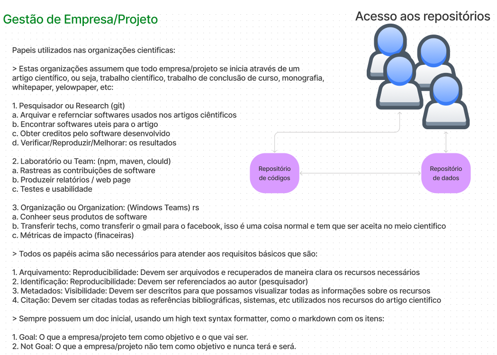

# F_SPEC_0000

Aqui teremos a conversa sobre quais tecnologias iremos utilizar em nossas soluções seguindo as premissas abaixo:

- Não ferir de forma alguma a privacidade e a autonomia do usuário de nossos produtos, ferramentas ou qualquer insumo fornecido a qualquer pessoa.
- Ser de utilidade prática e que melhore continua e permanentemente a vida de todas as pessoas que tiverem contato ou utilizem nossas soluções.
- Sempre colaborar de forma transparente e aberta para qualquer ideia, tecnologia, conversa, etc.

## Questões

- Iremos seguir um direcionamento Free Software Foundation, podemos ganhar patrocínio deles ou entrar em um grupo de doações com eles?

- Iremos ou teremos necessidade de ter um sistema identificador decentralizado, como é o a proposta da spec W3C DID?

- Iremos ou podemos ?pode ser uma boa? utilizar dados biométricos como pontos da face, digital, iris, escrita, etc para gerarmos uma criptografia inicial key-pair?

## Linguagem de Programação

### Backend Server Side Render

- [Erlang](https://erlang.org/)
- [Elixir](https://elixir-lang.org/)

TODO

## Referências

- [Manifesto GNU](https://www.gnu.org/gnu/manifesto.html)
